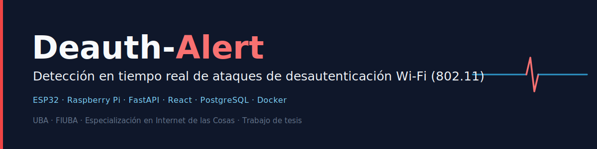

> 🌐 **English** · **[Español](README.md)**

<p align="center">
  
</p>

<p align="center">
  <i>IoT system for monitoring and detecting deauthentication attacks on Wi-Fi networks</i>
</p>

<p align="center">
  
  
  
  
  
  
  
  
  
</p>

<p align="center">
  <b>Distributed monitoring of the 2.4 GHz Wi-Fi spectrum with ESP32 nodes, Raspberry Pi, real-time alerts, and a web dashboard.</b>
</p>

<p align="center">
  <a href="https://youtu.be/P1Kr70pG77Y"><b>▶️ Watch the demo</b></a>
  &nbsp;·&nbsp;
  <a href="https://www.youtube.com/watch?v=JqII7Z1xTyE">🎓 Thesis defense (UBA)</a>
  &nbsp;·&nbsp;
  <a href="https://lse-posgrados-files.fi.uba.ar/tesis/LSE-FIUBA-Trabajo-Final-CEIoT-Eberth-Gabriel-Alarcon-Gonzalez-2025.pdf">📄 Thesis (PDF)</a>
</p>

> **Thesis project** · Specialization in the Internet of Things (IoT) · School of Engineering · University of Buenos Aires (UBA).

---

## In brief

> **Deauthentication attacks often happen with no real visibility for the people who administer and protect a network. Deauth-Alert was built to solve exactly that.**
>
> In many Wi-Fi environments, these events aren't detected in time, aren't logged in a structured way, and only become apparent once the disconnection is already disrupting operations. This project turns that blind spot into a signal that is visible, recordable, and actionable.
>
> For those who administer and defend a network, this means greater monitoring and response capability. For anyone trying to breach it, it means far less room to act without leaving evidence.
>
> **The three pillars of Deauth-Alert:**<br>📡 **Detect** · 🗂️ **Log** · 🔔 **Alert**

---

| ⚠️ **Responsible, authorized use** |
| :--- |
| This system places Wi-Fi interfaces in promiscuous mode to detect 802.11 deauthentication attacks. Use it only on networks you own or have explicit authorization to test. Capturing third-party traffic may violate applicable law. The author is not liable for any misuse. |

---

## Table of contents

- [Overview](#overview)
- [Architecture](#architecture)
- [Technologies](#technologies)
- [Repository structure](#repository-structure)
- [Getting started](#getting-started)
- [Academic evidence and public resources](#academic-evidence-and-public-resources)
- [Project status](#project-status)
- [Current scope](#current-scope)
- [Upcoming improvements](#upcoming-improvements)
- [Support the project](#support-the-project)
- [About the author](#about-the-author)
- [License](#license)

---

## Overview

A distributed IoT system that detects 802.11 deauthentication attacks in real time, a type of denial-of-service (DoS) attack that forces Wi-Fi clients to disconnect and enables more sophisticated attacks such as access point spoofing (*Evil Twin*).

**Goals:**

- Real-time monitoring of Wi-Fi management traffic in the 2.4 GHz band.
- Early detection with instant alerts (web dashboard, Telegram, and cloud).
- Low cost and scalability using affordable hardware (ESP32 + Raspberry Pi).

**Context (state of the art):** tools such as *Aircrack-ng* and *Wireshark* are effective for analysis, but they require constant supervision and don't automate the response; commercial intrusion detection solutions (*WIDS/IPS*) are robust, yet expensive and hard to adapt. This project explores an autonomous, low-cost alternative built on the ESP32-WROOM-32U in promiscuous mode and *Bluetooth Low Energy* (BLE).

---

## Architecture

The system is organized into four layers, from capturing the attack to real-time visualization.


**Event flow (detection → alert):**

1. An ESP32 node in promiscuous mode captures an 802.11 deauthentication *frame*.
2. The node compares the target BSSID and, on a match, emits an alert over BLE.
3. The Raspberry Pi receives the alert, persists it in PostgreSQL, and publishes it to AWS IoT and Telegram.
4. The FastAPI backend exposes the alert over REST and broadcasts it over WebSocket.
5. The React dashboard displays the alert in real time.


---

## Technologies

| Layer | Technical manual | Technology | Role |
| --- | --- | --- | --- |
| Perception | [Arduino](perception-layer/esp32-nodes-ino/README.en.md) · [ESP-IDF](perception-layer/espidf-nodes/README.en.md) | ESP32-WROOM-32U · C/C++ (Arduino `.ino` and ESP-IDF `.c`) | Captures deauthentication *frames* in promiscuous mode; sends them over BLE |
| Processing | [Processing](processing-layer/README.en.md) | Python (`bleak`, `paho-mqtt`, `psycopg2`) · Docker/PostgreSQL | BLE ingestion, persistence, MQTT/AWS IoT and Telegram publishing |
| Backend | [Backend](backend/README.en.md) | FastAPI · SQLAlchemy · PostgreSQL · JWT | REST API + WebSocket + authentication |
| Frontend | [Frontend](frontend/README.en.md) | React · Vite · TypeScript · TailwindCSS | Real-time dashboard |

### Hardware components

| Component | Role in the system |
| --- | --- |
| **ESP32-WROOM-32U** | Sensor node in the perception layer. Captures 802.11 Wi-Fi frames in promiscuous mode (2.4 GHz) and emits alerts over BLE. Includes a U.FL connector for an external antenna. |
| **Raspberry Pi 5 (8 GB RAM)** | Central processing unit. Receives BLE alerts, persists them in PostgreSQL, and publishes them to AWS IoT and Telegram. |

> Full specifications and the rationale behind each component choice are documented in the [thesis (PDF)](https://lse-posgrados-files.fi.uba.ar/tesis/LSE-FIUBA-Trabajo-Final-CEIoT-Eberth-Gabriel-Alarcon-Gonzalez-2025.pdf) (figures 2.1 and 2.2) and in the technical manual for each layer.

### Key versions

Taken from `requirements.txt`, `package.json`, the Dockerfiles, and `docker-compose.yml`.

| Component | Version |
| --- | --- |
| Python | 3.11 |
| FastAPI · Uvicorn | 0.139 · 0.51 |
| SQLAlchemy · Pydantic | 2.0 · 2.13 |
| PostgreSQL | 16 |
| React · Vite · TypeScript | 19 · 6 · 5.7 |
| Node (build) · nginx | 22 · 1.31 |

> Each technical manual details the installation and configuration of its layer.

---

## Repository structure

```
Deauth-Alert-WiFi-IoT-System/
├── perception-layer/     # ESP32 firmware (Arduino .ino + ESP-IDF .c), promiscuous mode
├── processing-layer/     # Raspberry Pi: BLE ingestion, PostgreSQL (Docker), MQTT/AWS, Telegram
├── backend/              # FastAPI API + PostgreSQL + JWT + WebSocket (Dockerfile included)
├── frontend/             # React + Vite + TypeScript dashboard (Dockerfile + nginx.conf)
├── docs/img/             # Diagrams and banner (SVG) used in the documentation
├── docker-compose.yml    # Web stack: postgres + backend + frontend (docker compose up)
├── .env.example          # Environment variable template (real .env files are NOT versioned)
├── .gitignore
└── README.md
```

> Sensitive files (`.env`, certificates, the nodes' `config.h`) **are not versioned**; `.example` / `_template` templates are provided instead.

---

## Getting started

**Requirements:** Docker (for the web stack). For the physical lab, you'll also need: Raspberry Pi (Raspberry Pi OS) · 4× ESP32-WROOM-32U · Python 3.11+ · Node.js 20+.

```bash
git clone https://github.com/Eberth-sys/Deauth-Alert-WiFi-IoT-System.git
cd Deauth-Alert-WiFi-IoT-System
```

### Option A. Web stack with Docker (recommended, no hardware)

Brings up **postgres + backend + frontend** with a single command (configured through environment variables; secrets come from `.env` at **runtime**, never baked into the images):

```bash
cp .env.example .env          # fill in: PG_*, JWT_SECRET_KEY (>=32), SERVICE_API_KEY, CORS_ORIGINS, VITE_*
docker compose up --build
```

| Service | URL |
| --- | --- |
| Frontend (dashboard) | http://localhost:8080 |
| Backend (API + `/docs`) | http://localhost:8000 |
| PostgreSQL | localhost:5432 |

> The `processing-layer` (BLE) and the ESP32 firmware are **not** part of this `docker compose`: they require hardware (Raspberry Pi + ESP32 nodes) and run separately (see Option B and the lab setup).

### Try it without hardware (ESP32 node simulator)

Don't have the hardware yet, or want to evaluate the project before investing in the equipment? The [`tools/simulate_esp32.py`](tools/simulate_esp32.py) tool lets you try Deauth-Alert end to end without buying anything. It generates the same alerts an ESP32 node would produce upon detecting an attack and inserts them into the database, using the same columns as the processing layer. This lets you see the dashboard, the alerts, and the full flow in action before setting up the physical lab.

> **This is a simulation for demonstration and development (a _mock_).** It does not run or reproduce a real attack: it injects the alerts directly into the data layer, without the ESP32 firmware, promiscuous-mode capture, or BLE transport. Detection against real deauthentication attacks (for example, using `aireplay-ng`) was validated in the lab with physical hardware; you can watch it in the [system demo](https://youtu.be/P1Kr70pG77Y).

With the web stack already running (Option A), from the repository root:

```bash
# Linux / macOS: connection variables (the same as in the web stack's .env)
export PG_HOST=localhost PG_PORT=5432 PG_DB=deauth_alerts \
       PG_USER=<user> PG_PASSWORD=<password>

pip install psycopg2-binary          # first time only, if not already installed
python tools/simulate_esp32.py --count 10 --interval 2
```

```powershell
# Windows PowerShell: connection variables
$env:PG_HOST="localhost"; $env:PG_PORT="5432"; $env:PG_DB="deauth_alerts"
$env:PG_USER="<user>"; $env:PG_PASSWORD="<password>"

pip install psycopg2-binary
python tools/simulate_esp32.py --count 10 --interval 2
```

| Parameter | Description | Default |
| --- | --- | --- |
| `--count` | Number of alerts to send | 6 |
| `--interval` | Seconds between each alert | 2.0 |

Then log in to the dashboard (`http://localhost:8080`) and you'll see the alerts appear in real time. The generated MAC addresses are examples (prefixes `DE:AD:BE:EF` and `02:00:00`); they don't correspond to real hardware.

### Option B. Manual execution and per-layer development

> Full details for each layer are in its `README.en.md`. Commands by layer:

**1. Database (PostgreSQL in Docker · edge/RPi layer only)**
```bash
cd processing-layer/docker
cp .env.example .env          # fill in credentials
docker compose up -d          # this compose (edge/RPi) brings up ONLY PostgreSQL; full web stack: Option A
```

**2. Backend (FastAPI),** with `uvicorn` (or inside a container via Option A):
```bash
cd backend/src
cp .env.example .env
pip install -r requirements.txt
uvicorn main:app --reload     # http://localhost:8000 · documentation: /docs
```

**3. Frontend (React + Vite)**
```bash
cd frontend
cp .env.example .env
npm install
npm run dev                   # http://localhost:5173
```

**4. Processing layer (Raspberry Pi, BLE)**
```bash
cd processing-layer
cp config/devices.yaml.example config/devices.yaml   # node MACs/UUIDs
pip install -r requirements.txt
python main.py                # requires Bluetooth (BlueZ) and the ESP32s paired
```

**5. ESP32 firmware.** See [`perception-layer/`](perception-layer/) to build and flash the nodes (create `config.h` from the template).

---

## Academic evidence and public resources

- 📄 **Thesis (final project, PDF):** [LSE-FIUBA · CEIoT · 2025](https://lse-posgrados-files.fi.uba.ar/tesis/LSE-FIUBA-Trabajo-Final-CEIoT-Eberth-Gabriel-Alarcon-Gonzalez-2025.pdf)
- 📊 **Thesis presentation (PDF):** [defense slides](https://lse-posgrados-files.fi.uba.ar/tesis/LSE-FIUBA-Trabajo-Final-CEIoT-Eberth-Gabriel-Alarcon-Gonzalez-2025-Presentacion.pdf)
- 🎓 **Thesis defense (UBA, video):** [watch on YouTube](https://www.youtube.com/watch?v=JqII7Z1xTyE)
- ▶️ **System demo (video):** [watch on YouTube](https://youtu.be/P1Kr70pG77Y)

### How to cite

```bibtex
@thesis{alarcon2025deauthalert,
  author = {Alarcón González, Eberth Gabriel},
  title  = {Sistema IoT para el monitoreo y detección de ataques de desautenticación en redes Wi-Fi},
  school = {Universidad de Buenos Aires, Facultad de Ingeniería},
  year   = {2025},
  type   = {Trabajo Final de la Carrera de Especialización en Internet de las Cosas}
}
```

---

## Project status

Deauth-Alert was designed from the outset with a production-oriented architecture: JWT authentication, configuration through environment variables, reproducible Docker containers, and a layered separation (perception, processing, backend, frontend). Today it is a **functional academic prototype**, validated in the lab with ESP32 nodes and a Raspberry Pi. The security and deployment considerations for moving toward a production environment are documented in [`SECURITY.md`](SECURITY.md).

---

## Current scope

- Real-time detection of 802.11 deauthentication attacks in the 2.4 GHz band.
- Alerts via web dashboard, Telegram, and cloud (AWS IoT).
- Reproducible deployment of PostgreSQL, backend, and frontend via Docker (`docker compose up`).
- The perception layer (ESP32 firmware) and the processing layer (BLE, Raspberry Pi) run on dedicated hardware.

---

## Upcoming improvements

- A versioned JSON contract for ESP32 → Raspberry Pi communication.
- Containerization of the edge layer and building with ESP-IDF.
- Expanded test coverage.
- *(Exploratory)* Adding AI and machine learning for event correlation and anomaly detection.

---

## Support the project

If you find this work useful, there are several ways to contribute:

- ⭐ **Star** the repository to give it visibility.
- 🐛 Report bugs or suggestions via **issues**.
- 🔧 Propose improvements through **pull requests**.
- 📢 Share the project link with academic, technical, and research communities.

> Use, modification, and distribution of the code and original documentation are governed by the Apache 2.0 license.

---

## About the author

**Esp. Ing. Eberth Gabriel Alarcón González**

Electronics Engineer, Telecommunications track · Internet of Things Specialist

### 👤 Professional profile

Electronics Engineer specializing in Telecommunications from **Universidad Rafael Belloso Chacín (URBE, 2014)** and an Internet of Things specialist from the **University of Buenos Aires (UBA)**. He has over ten years of experience in information technology, with a solid foundation in telecommunications, networking, and infrastructure, and a career increasingly focused on cybersecurity.

He currently works as a **cybersecurity engineer**, focusing on security for artificial intelligence systems and language models (**AI and LLMs**), security in **IoT** environments, penetration testing, network security, and incident response.

**Deauth-Alert** is the final thesis project of his Internet of Things specialization and represents the convergence of wireless networks, connected devices, and applied cybersecurity.

### 🎓 Academic background

* **Specialization in the Internet of Things** · University of Buenos Aires, Argentina (**2025**)
  Final thesis: **Deauth-Alert**

* **Electronics Engineering, Telecommunications track** · Universidad Rafael Belloso Chacín, Venezuela (**2014**)


### 🛡️ Areas of expertise

- Cybersecurity and incident response.
- Security of AI systems and language models (AI and LLMs).
- Security of IoT devices and architectures.
- Penetration testing and vulnerability assessment.
- Network and endpoint security.
- Telecommunications and network infrastructure.

[](https://www.linkedin.com/in/eberthalarcon90)


School of Engineering (FIUBA), University of Buenos Aires · Specialization Program in the Internet of Things

---

## License

The code and original documentation in this repository are distributed under the Apache 2.0 license. See [LICENSE](LICENSE) for the terms of use and [NOTICE](NOTICE) for attribution, trademarks, and excluded materials.

© 2025-2026 Esp. Ing. Eberth Gabriel Alarcón González.

---
