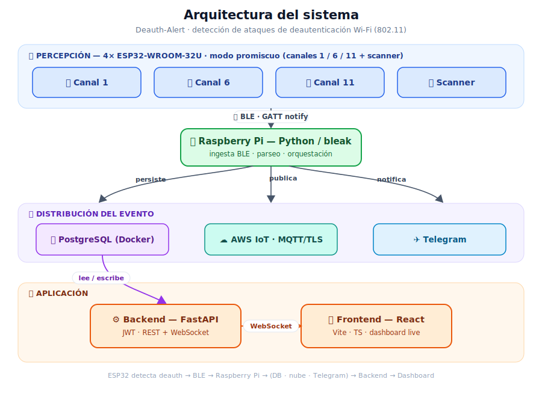
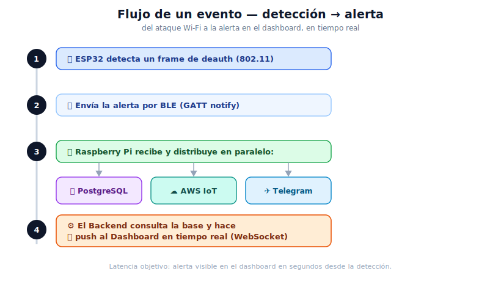
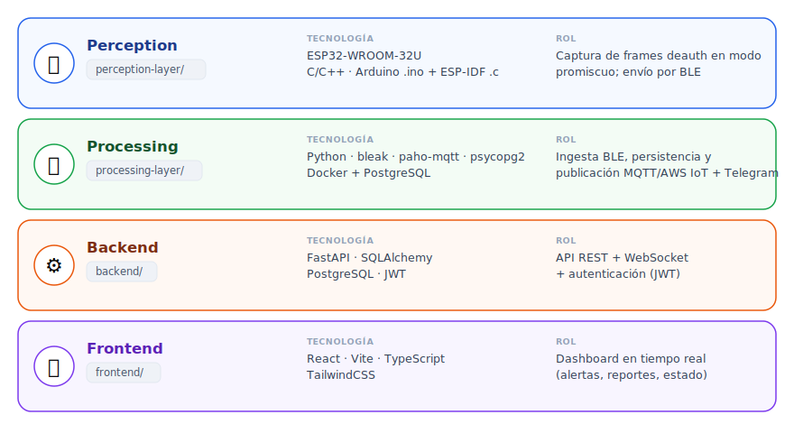

# Sistema IoT para el Monitoreo y Detección de Ataques de Desautenticación en Redes Wi-Fi (2,4 GHz)

> **Trabajo de tesis** — Especialización en Internet de las Cosas (IoT) · Facultad de Ingeniería · Universidad de Buenos Aires (UBA) 🇦🇷

> ⚠️ **Uso autorizado únicamente.** Este sistema configura interfaces Wi-Fi en **modo promiscuo** para detectar ataques de deautenticación 802.11. Debe usarse **solo en redes propias o donde se cuente con autorización explícita**. Monitorear tráfico de redes de terceros puede constituir un delito según la legislación aplicable. El autor no se responsabiliza por usos indebidos.

> ℹ️ **Madurez.** Prototipo académico **funcional** pero **no endurecido para producción**. Revisá [Estado y limitaciones](#estado-del-proyecto-y-limitaciones-conocidas) y [`SECURITY.md`](SECURITY.md) antes de exponerlo en una red.

---

## Índice
- [Descripción general](#descripción-general)
- [Arquitectura](#arquitectura)
- [Estructura del repositorio](#estructura-del-repositorio)
- [Puesta en marcha](#puesta-en-marcha)
- [Estado del proyecto y limitaciones conocidas](#estado-del-proyecto-y-limitaciones-conocidas)
- [Roadmap](#roadmap)
- [Contribuciones](#contribuciones)
- [Autor](#autor)
- [Licencia](#licencia)

---

## Descripción general

Sistema **IoT distribuido** que detecta en **tiempo real** ataques de **deautenticación 802.11** — un tipo de *Denial of Service* (DoS) que fuerza la desconexión de clientes Wi-Fi y habilita ataques más complejos como la suplantación de puntos de acceso (*Evil Twin*).

**Objetivos:**
- **Monitoreo en tiempo real** del tráfico de gestión Wi-Fi en 2,4 GHz.
- **Detección temprana** con alertas inmediatas (dashboard web, Telegram y nube).
- **Bajo costo y escalabilidad** usando hardware accesible (ESP32 + Raspberry Pi).

**Contexto (estado del arte):** herramientas como *Aircrack-ng* o *Wireshark* son eficaces para el análisis pero requieren supervisión continua y no automatizan la respuesta; los *WIDS/IPS* comerciales son robustos pero costosos y difíciles de adaptar. Este proyecto explora una alternativa **autónoma y de bajo costo** basada en **ESP32-WROOM-32U** en modo promiscuo + **Bluetooth Low Energy (BLE)**.

---

## Arquitectura

Cuatro capas, desde la captura del ataque hasta la visualización en tiempo real:



### Flujo de un evento (detección → alerta)





<details>
<summary><b>Ver las capas como tabla de texto</b></summary>

| Capa | Carpeta | Tecnología | Rol |
| --- | --- | --- | --- |
| **Perception** | `perception-layer/` | ESP32-WROOM-32U · C/C++ (Arduino `.ino` y ESP-IDF `.c`) | Captura de frames deauth en modo promiscuo; envío por BLE |
| **Processing** | `processing-layer/` | Python (`bleak`, `paho-mqtt`, `psycopg2`) · Docker/PostgreSQL | Ingesta BLE, persistencia, publicación MQTT/AWS IoT y Telegram |
| **Backend** | `backend/` | FastAPI · SQLAlchemy · PostgreSQL · JWT | API REST + WebSocket + autenticación |
| **Frontend** | `frontend/` | React · Vite · TypeScript · TailwindCSS | Dashboard en tiempo real |

</details>

> Cada capa incluye su propio `README.md` con instrucciones detalladas.

---

## Estructura del repositorio

```
Deauth-Alert-WiFi-IoT-System/
├── perception-layer/     # Firmware ESP32 (Arduino .ino + ESP-IDF .c) — modo promiscuo
├── processing-layer/     # Raspberry Pi: ingesta BLE, PostgreSQL (Docker), MQTT/AWS, Telegram
├── backend/              # API FastAPI + PostgreSQL + JWT + WebSocket (Dockerfile incluido)
├── frontend/             # Dashboard React + Vite + TypeScript (Dockerfile + nginx.conf)
├── docs/img/             # Diagramas (SVG) usados en la documentación
├── docker-compose.yml    # Web-stack: postgres + backend + frontend (docker compose up)
├── .env.example          # Plantilla de variables de entorno (los `.env` reales NO se versionan)
├── .gitignore
└── README.md
```

> Los archivos sensibles (`.env`, certificados, `config.h` de los nodos) **no se versionan**; se proveen plantillas `.example` / `_template`.

---

## Puesta en marcha

**Requisitos:** Docker (para el web-stack). Para el laboratorio físico además: Raspberry Pi (Raspberry Pi OS) · 4× ESP32-WROOM-32U · Python 3.11+ · Node.js 18+.

### Opción A — Web-stack con Docker (recomendada, sin hardware)

Levanta **postgres + backend + frontend** con un solo comando (configuración 12-factor; los secretos vienen del `.env` en **runtime**, nunca horneados en las imágenes):

```bash
cp .env.example .env          # completar: PG_*, JWT_SECRET_KEY (≥32), SERVICE_API_KEY, CORS_ORIGINS, VITE_*
docker compose up --build
```

| Servicio | URL |
| --- | --- |
| Frontend (dashboard) | http://localhost:8080 |
| Backend (API + `/docs`) | http://localhost:8000 |
| PostgreSQL | localhost:5432 |

> La **processing-layer (BLE)** y el **firmware ESP32** **no** están en este compose: requieren hardware (Raspberry Pi + nodos ESP32) y se ejecutan aparte (ver Opción B y el laboratorio).

### Opción B — Ejecución manual / desarrollo por capa

> El detalle completo de cada capa está en su README. Resumen honesto de comandos:

**1. Base de datos (PostgreSQL en Docker · solo capa edge/RPi)**
```bash
cd processing-layer/docker
cp .env.example .env          # completar credenciales
docker compose up -d          # este compose (edge/RPi) levanta SOLO PostgreSQL — web-stack completo: Opción A
```

**2. Backend (FastAPI)** — con `uvicorn` (o dockerizado vía la Opción A):
```bash
cd backend/src
cp .env.example .env
pip install -r requirements.txt
uvicorn main:app --reload     # http://localhost:8000 · documentación: /docs
```

**3. Frontend (React + Vite)**
```bash
cd frontend
cp .env.example .env
npm install
npm run dev                   # http://localhost:5173
```

**4. Processing layer (Raspberry Pi, BLE)**
```bash
cd processing-layer
cp config/devices.yaml.example config/devices.yaml   # MACs/UUIDs de tus nodos
pip install -r requirements.txt
python main.py                # requiere Bluetooth (BlueZ) y los ESP32 emparejados
```

**5. Firmware ESP32** — ver [`perception-layer/`](perception-layer/) para compilar/flashear los nodos (crear `config.h` a partir del template).

---

## Estado del proyecto y limitaciones conocidas

Este es un **prototipo de tesis**, funcional pero con deuda técnica documentada. A tener en cuenta antes de cualquier uso más allá de un laboratorio controlado:

- **No endurecido para producción.** El backend ya cuenta con **controles básicos de autenticación y hardening aplicados en Fase 6** (auth en rutas y WebSocket, `/logs` admin-only, reset endurecido, credencial máquina-a-máquina), pero aún requiere **revisión adicional antes de exponerse a redes no confiables**: CORS, rotación operativa de secretos, validación física end-to-end y hardening de despliegue — ver [`SECURITY.md`](SECURITY.md).
- **Contrato ESP32→RPi en texto plano.** El evento viaja por BLE como una cadena delimitada (no JSON versionado) y su parser es posicional. *(Mejora planificada.)*
- **Contenerización del web-stack completa.** `docker compose up` levanta postgres + backend + frontend. La **processing-layer (BLE)** y el **firmware ESP32** quedan **fuera de Docker** (requieren hardware/laboratorio).
- **Cobertura de tests limitada** y **dependencias sin fijar** en algunas capas (reproducibilidad).

---

## Roadmap

- [ ] Endurecer la seguridad del backend (auth en todas las rutas y WebSocket, hardening general).
- [ ] Migrar el contrato ESP32→RPi a **JSON versionado** (`node_id`, `timestamp`, `event_type`, etc.).
- [ ] Contenerizar la **capa edge** (processing-layer/BLE en la Raspberry Pi) + build ESP-IDF *(el web-stack DB + backend + frontend ya corre con `docker compose up`)*.
- [ ] Suite de tests + fijado de dependencias + CI.
- [ ] *(Exploratorio)* Incorporar **IA/ML** para correlación de eventos y detección de anomalías.

---

## Contribuciones

Sugerencias y mejoras son bienvenidas mediante *issues* y *pull requests*. Para cambios grandes, abrí primero un *issue* para discutir el enfoque.

---

## Autor

**Esp. Ing. Eberth Gabriel Alarcón** — ingeniero electrónico especializado en telecomunicaciones, redes y ciberseguridad, con enfoque en tecnologías IoT.

🌐 [LinkedIn — Eberth Alarcón](https://www.linkedin.com/in/eberthalarcon90)

**Universidad de Buenos Aires (UBA)** 🇦🇷 · Facultad de Ingeniería · Especialización en Internet de las Cosas (IoT).


---

## Licencia

**Licencia pendiente de definición.** Se establecerá antes de la publicación pública definitiva.
Hasta entonces: © 2025 Eberth Alarcón — todos los derechos reservados.

---
